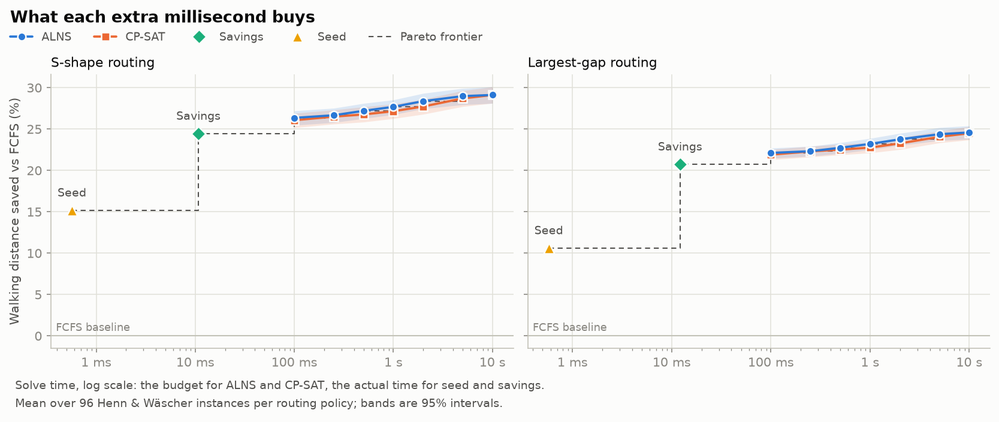

# Fulfilment Optimisation

> **Category:** MLOps & Deployment · **Status:** 🚧 In progress

## Problem

> For a manual picker-to-parts warehouse, how much walking distance can batching and routing
> optimisation save compared with first-come-first-served greedy batching, and what does each
> extra millisecond of solve time buy?

An order-batching and pick-path optimisation API that beats a greedy baseline within a hard latency
budget, benchmarked against published academic instances so the claims can be checked.

<picture>
  <source media="(prefers-color-scheme: dark)" srcset="reports/figures/pareto_dark.png">
  
</picture>

Savings captures most of the gain in about 10 ms: 24% less walking than FCFS with S-shape
routing. ALNS adds 2 points by 100 ms and 4.7 by 10 s. CP-SAT stays just below ALNS at every
budget and only draws level at 10 s ([data](../../docs/projects/p1-fulfilment-optimisation/results/pareto.md)).

## Data

| Source | What | Licence | Use |
|--------|------|---------|-----|
| [KIT Manual Warehouse Order Picking benchmarks](https://doi.org/10.35097/mwsv59v8sk9sqaan) (Barlang, Lehmann, Furmans, 2026) | 2.0 GB JSON: layouts, orders per shift, lines per order, arrival randomness, due dates and storage policies; 132 designed parameter sets (32 one-factor-at-a-time + 100 Latin hypercube) × 100 replications | CC BY 4.0 | Calibrate the generator's parameter ranges; stress scenarios |
| [Henn & Wäscher (2012) batching instances](https://grafo.etsii.urjc.es/optsicom/obsp.html) | 96 instances: 10 aisles × 90 locations, depot bottom-left, 20–80 orders, capacity 45 or 75, due dates | Not stated: fetched by script, not redistributed | External benchmark |
| [Arbex Valle et al. Foodmart instances](https://homepages.dcc.ufmg.br/~arbex/orderpicking.html) | 8/16-aisle single- and dual-block layouts, 1,560 SKUs, 5–5,000 orders | Not stated: fetched by script, not redistributed | External benchmark + realistic SKU/order-size distributions |
| Own generator | Parameterised warehouse + order stream | MIT | Everything else |

Raw data lives in `data/raw/` and is never committed. Instances without a stated licence are
downloaded by script rather than redistributed; see [`data/README.md`](data/README.md).

## Approach

The warehouse is a single block of parallel aisles with the depot in front of aisle 0, using the
Henn & Wäscher (2012) geometry so distances are comparable with the published instances. Each order
is a set of pick locations, and a picker can carry a fixed number of items per tour.

**Batching solvers** group orders into tours. All share one interface (`solvers/base.py`): a
solver takes a deadline, publishes improvements to a thread-safe incumbent, and returns its best
solution.

| Solver | What it does | Reference |
|--------|--------------|-----------|
| FCFS (baseline) | Fills each tour in arrival order until the next order doesn't fit | – |
| Seed | Seeds each tour with the order visiting most aisles, then adds the orders that add the fewest new aisles | de Koster et al. (1999) |
| Savings | Merges the pair of tours with the largest distance saving, re-costing exactly after every merge (C&W(ii)) | de Koster et al. (1999) |
| ALNS | Adaptive large neighbourhood search from the savings start: 3 destroy and 2 repair operators, simulated annealing, adaptive weights, cached tour costs | Ropke & Pisinger (2006) |
| CP-SAT | Set partitioning over a pool of candidate tours, each costed exactly; exact on ≤ 12 orders, otherwise the pool comes from ALNS | OR-Tools |

**Routing** turns a tour's picks into a walk: S-shape and largest-gap (`routing/`). Batching
solvers only ask the router for tour lengths, so routing policies are interchangeable.

**Benchmark harness** (`benchmark.py`) runs every solver × router × instance × time limit from
`config.yaml` in a process pool, checks every solution is feasible, and writes
`outputs/runs.parquet` and `outputs/metrics.json`.

**Service** (`api/`): `POST /batch` takes orders, a layout, picker capacity, a solver, a router and
`budget_ms`. The budget is a hard limit on server-side response time: FCFS is computed first, the
chosen solver runs in a worker thread, and at the deadline the service returns the solver's best
solution so far, or FCFS (`fallback_used: true`) if there is nothing better. Requests over the
order limit get 413; requests that can't be solved as given (an order over capacity, a pick
outside the layout) get 422 with a message.

## Results

_Interim: the Pareto chart over budgets is still to come._

| Solver | Distance saved vs FCFS (S-shape) | (largest gap) | Solve time p50 / p95 |
|--------|---------------------------------:|--------------:|---------------------:|
| FCFS | – | – | < 0.1 ms |
| Seed | 15.2% | 10.6% | 0.6 / 1.5 ms |
| Savings | 24.4% | 20.7% | 11–20 / 35–57 ms |
| ALNS | **27.8%** | **23.0%** | uses the 1 s budget |
| CP-SAT | 27.2% | 22.9% | uses the 1 s budget |

Mean over 96 instances per routing policy, on a laptop CPU. ALNS and CP-SAT are never worse than
savings on any instance; seed is worse than FCFS on 4.

**Against published results.** No per-instance distances are published for these instances, so
the check is relative: each solver's improvement over C&W(ii) savings, per class, against Henn &
Wäscher's best method (ABHC*, within 0.1–1.4% of optimal) on their instances from the same
generator. The tolerance, set before the per-class results were computed, is 1 percentage point
below theirs. ALNS is within it on **12 of 12** shared classes at 10 s and at 60 s, but on only 4
of 12 at 1 s: larger instances need more iterations
([full table](../../docs/projects/p1-fulfilment-optimisation/results/published_comparison.md)).
With S-shape routing, ALNS improves on savings by 1–3 points *more* than ABHC*, which says more
about the baseline or the instance sample than about ALNS beating a near-optimal method; the
relative measure can't separate small differences.

The published per-instance values are tardiness, not distance. Reproducing the published EDD
tardiness didn't work: our values are 0.3–0.6× theirs, although our single-order processing
times match the generator that produced the instances' due dates (R² 0.994). What was tried is
in [`references/README.md`](references/README.md).

**Service latency** (ALNS, requests of 10–300 orders, server-side time from the `Server-Timing`
header): with a 50 ms budget, p99 is 22.7 ms on the laptop, since the solver stops 30 ms early to
leave time for the response. On one emulated x86 CPU, closer to a small cloud instance, the
slowest of 300 requests took 50.6 ms. Live numbers come with the deploy.

## Key takeaways

Interim, from the 1 s results above:

- **Savings captures most of the gain.** It saves 21–24% in tens of milliseconds; ALNS adds
  another 2–4 points with a full second.
- **ALNS needs more than 1 s on 60+ orders to match published quality.** At 10 s it is within
  1 point of the best published method on every shared class. The largest-gap router is 4.5×
  slower per call than S-shape, so it gets fewer iterations per second.
- **CP-SAT doesn't beat ALNS at any budget up to 10 s.** Half the budget goes on building its
  pool, which costs more than recombining tours gains back; it draws level only at 10 s. It proves optimality over its pool on 71% of 20-order
  instances, but almost never at 40 orders or more.
- **A hard latency budget takes engineering beyond the solver.** Keeping p99 under budget needed
  the clock to start when the request arrives, the response built without nested pydantic models,
  and garbage collection moved between requests.
- **Limitation:** everything assumes a single-block rectangular layout, the benchmarks' geometry.
  Real sites are often irregular; graph-defined layouts are planned as phase 3.

## Reproduce

```bash
# from the repo root, with the venv active (`make setup-all`, or at least the app and opt extras)
cd projects/01-fulfilment-optimisation
PYTHONPATH=src python -m fulfilment_optimisation.download henn_waescher  # instances → data/raw/
PYTHONPATH=src python -m fulfilment_optimisation.benchmark               # grid from config.yaml → outputs/
pytest
```

The Pareto chart needs a sweep over budgets (about 45 minutes). It runs in three parts so that
single-threaded ALNS can use one worker per performance core while CP-SAT, which runs 4 threads
per solve, gets fewer workers:

```bash
B="PYTHONPATH=src python -m fulfilment_optimisation.benchmark"
eval $B --solvers fcfs seed savings --time-limits 1 --workers 6 --output sweep_constructive.parquet
eval $B --solvers alns --time-limits 0.1 0.25 0.5 1 2 5 10 \
    --param alns.max_iterations=100000000 --workers 6 --output sweep_alns.parquet
eval $B --solvers cp_sat --time-limits 0.1 0.25 0.5 1 2 5 10 \
    --param cp_sat.pool_iterations=100000000 --workers 2 --output sweep_cp_sat.parquet
PYTHONPATH=src python -m fulfilment_optimisation.report  # → reports/figures/pareto*.png
```

The benchmark grid (solvers, routers, time limits, seeds) and every solver parameter are in
`config.yaml`. FCFS, seed and savings are deterministic. ALNS and CP-SAT are deterministic for a
fixed seed and iteration cap, but under a time limit the number of iterations depends on machine
speed, so their numbers vary slightly between runs.

## Run locally

The service runs in a container. Build from the repo root, since the image includes the shared
`src/portfolio` package:

```bash
docker build -f projects/01-fulfilment-optimisation/Dockerfile -t fulfilment-optimisation .
docker run --rm -p 8080:8080 fulfilment-optimisation
```

In another terminal:

```bash
curl -s localhost:8080/batch -H 'Content-Type: application/json' \
  -d @projects/01-fulfilment-optimisation/examples/batch_request.json
```

The response lists each batch's orders and its picker route, with the total distance. Interactive
API docs are at <http://localhost:8080/docs>.

The image is 126 MB compressed (577 MB unpacked, most of it OR-Tools). It contains no benchmark
data: its ignore file lets in only the code and `config.yaml`.

## Skills demonstrated

- Optimisation modelling: set partitioning in CP-SAT, and when an exact model loses to a heuristic
- Metaheuristics: ALNS with adaptive operator weights and simulated annealing, built from scratch
- Classic OR heuristics: seed batching, Clarke & Wright savings, S-shape and largest-gap routing
- Anytime algorithms behind a hard latency budget, with a thread-safe incumbent and FCFS fallback
- Performance work: cost caching, incremental insertion costs, response building and GC tuning
- Benchmarking: a reproducible grid with feasibility checks on every result
- Service engineering: FastAPI contract with clear 413/422 errors, multi-stage Docker image
